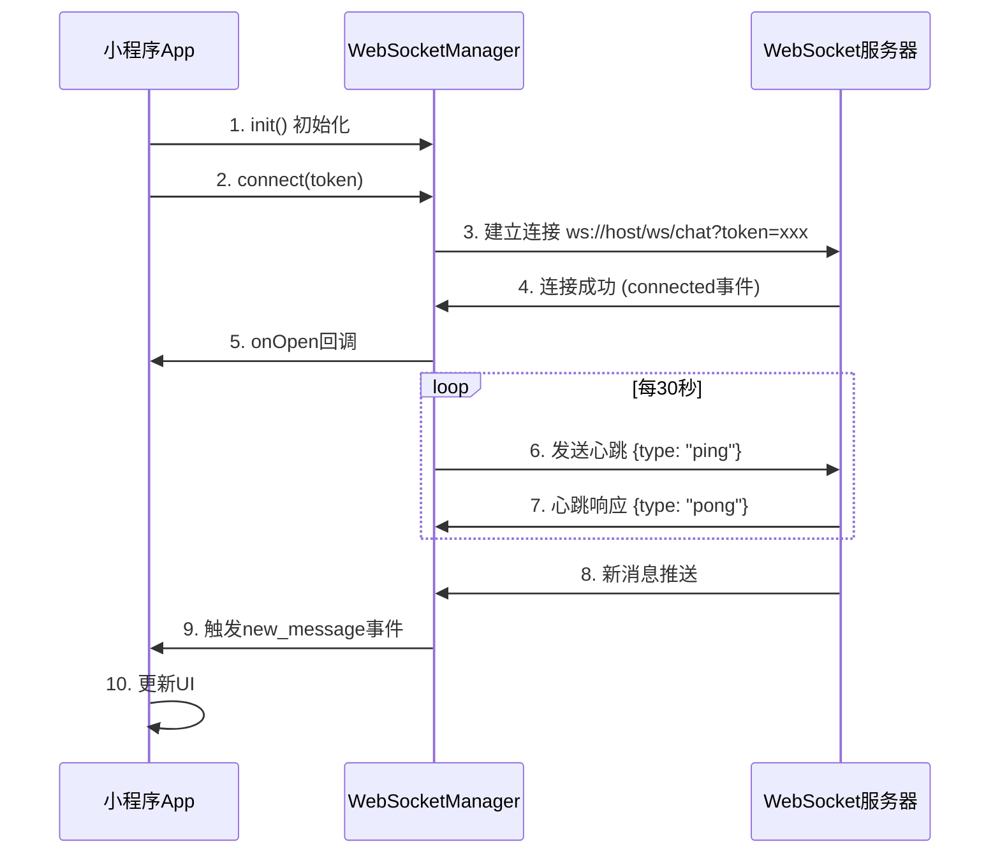

# 前端聊天系统实现方案

## 📋 目录

1. [概述](#概述)
2. [架构设计](#架构设计)
3. [核心模块设计](#核心模块设计)
4. [WebSocket 管理](#websocket-管理)
5. [数据流设计](#数据流设计)
6. [UI 组件设计](#ui-组件设计)
7. [状态管理](#状态管理)
8. [性能优化](#性能优化)
9. [错误处理与容错](#错误处理与容错)
10. [实现步骤](#实现步骤)
11. [技术栈与依赖](#技术栈与依赖)

---

## 概述

### 功能范围

本方案涵盖微信小程序前端聊天系统的完整实现，包括：

- ✅ 会话列表管理（获取、创建、删除）
- ✅ 消息发送与接收（文本、图片、语音、视频）
- ✅ 实时消息推送（WebSocket）
- ✅ 消息已读状态管理
- ✅ 消息撤回功能（2 分钟内）
- ✅ 未读消息统计
- ✅ 聊天历史记录（游标分页）
- ✅ 在线状态显示

### 技术特点

- 基于微信小程序原生框架
- WebSocket 实时通信
- 本地消息缓存与同步
- 断线重连机制
- 消息去重处理
- 虚拟滚动优化（大量消息场景）

---

## 架构设计

### 整体架构图

```
┌─────────────────────────────────────────────────────────────┐
│                     微信小程序前端                              │
├─────────────────────────────────────────────────────────────┤
│                                                               │
│  ┌──────────────┐  ┌──────────────┐  ┌──────────────┐      │
│  │   会话列表页   │  │   聊天详情页   │  │  其他业务页    │      │
│  │  (message)   │  │ (chat-detail)│  │              │      │
│  └──────┬───────┘  └──────┬───────┘  └──────┬───────┘      │
│         │                 │                  │              │
│         └─────────────────┼──────────────────┘              │
│                           │                                 │
│                  ┌────────▼────────┐                        │
│                  │   聊天管理模块    │                        │
│                  │ (ChatManager)   │                        │
│                  └────────┬────────┘                        │
│                           │                                 │
│         ┌─────────────────┼─────────────────┐              │
│         │                 │                 │              │
│  ┌──────▼──────┐  ┌───────▼───────┐  ┌─────▼─────┐       │
│  │ WebSocket   │  │   REST API    │  │  本地存储   │       │
│  │   Manager   │  │   (chat.js)   │  │ (Storage)  │       │
│  └──────┬──────┘  └───────┬───────┘  └─────┬─────┘       │
│         │                 │                 │              │
└─────────┼─────────────────┼─────────────────┼──────────────┘
          │                 │                 │
          │                 │                 │
┌─────────▼─────────────────▼─────────────────▼──────────────┐
│                     后端服务                                  │
│  ┌──────────────┐  ┌──────────────┐  ┌──────────────┐     │
│  │  WebSocket   │  │  REST API    │  │    Redis     │     │
│  │   服务端      │  │   服务端      │  │   (缓存)      │     │
│  └──────────────┘  └──────────────┘  └──────────────┘     │
│         │                 │                 │              │
│         └─────────────────┼─────────────────┘              │
│                           │                                │
│                  ┌────────▼────────┐                       │
│                  │    MySQL 数据库   │                       │
│                  └─────────────────┘                       │
└─────────────────────────────────────────────────────────────┘
```

### 模块划分

#### 1. **页面层**

- `pages/message/message` - 会话列表页
- `pages/chat-detail/chat-detail` - 聊天详情页

#### 2. **业务层**

- `utils/chat-manager.js` - 聊天管理核心模块（单例）
- `api/chat.js` - REST API 接口封装（已存在）

#### 3. **通信层**

- `utils/websocket-manager.js` - WebSocket 连接管理

#### 4. **数据层**

- 本地存储（wx.storage） - 消息缓存、会话缓存
- 内存缓存 - 当前会话消息列表

---

## 核心模块设计

### 1. ChatManager（聊天管理模块）

**职责**：

- 统一管理所有聊天相关的业务逻辑
- 维护会话列表和消息列表的状态
- 协调 REST API 和 WebSocket
- 处理消息去重、排序、分页

**文件位置**：`src/utils/chat-manager.js`

**核心接口**：

```javascript
class ChatManager {
  // 单例模式
  static getInstance()

  // 初始化（在小程序 app.js 中调用）
  init()

  // 会话管理
  async loadConversations(page, size)
  async createConversation(otherUserId)
  async deleteConversation(conversationId)
  getConversation(conversationId)
  getConversations()

  // 消息管理
  async loadMessages(conversationId, beforeMessageId, size)
  async sendMessage(conversationId, toUserId, messageType, content, mediaUrl, mediaDuration)
  async recallMessage(messageId)
  async markAsRead(conversationId)

  // 未读数
  async getUnreadCount()

  // 事件监听
  on(event, callback)
  off(event, callback)
  emit(event, data)

  // 清理
  destroy()
}
```

**数据存储结构**：

```javascript
{
  // 会话列表（按更新时间倒序）
  conversations: [
    {
      conversationId: "conv_abc123",
      type: 1,
      otherUserId: "U1699123456789AB12CD",
      otherUserNickname: "张三",
      otherUserAvatar: "https://example.com/avatar.jpg",
      otherUserOnline: true,
      lastMessage: {
        content: "你好",
        messageType: 1,
        sendTime: "2024-11-29T10:30:00"
      },
      unreadCount: 3,
      updateTime: "2024-11-29T10:30:00"
    }
  ],

  // 每个会话的消息列表（按时间正序，最新的在后）
  messages: {
    "conv_abc123": [
      {
        id: 12345,
        messageId: "msg_xyz789",
        conversationId: "conv_abc123",
        fromUserId: "U1699123456789AB12CD",
        fromUserNickname: "张三",
        fromUserAvatar: "https://example.com/avatar.jpg",
        toUserId: "U1699123456789AB12EF",
        messageType: 1, // 1-文本, 2-图片, 3-语音, 4-视频
        content: "你好",
        mediaUrl: null,
        mediaDuration: null,
        status: 4, // 1-发送中, 2-已发送, 3-已送达, 4-已读, 5-失败
        isRecalled: false,
        sendTime: "2024-11-29T10:30:00",
        readTime: "2024-11-29T10:31:00",
        isSelf: false
      }
    ]
  },

  // 当前打开的会话ID
  currentConversationId: null,

  // 未读消息总数
  totalUnreadCount: 0
}
```

### 2. WebSocketManager（WebSocket 管理模块）

**职责**：

- 管理 WebSocket 连接生命周期
- 处理心跳保持连接
- 实现断线重连机制
- 消息路由与分发

**文件位置**：`src/utils/websocket-manager.js`

**核心接口**：

```javascript
class WebSocketManager {
  // 单例模式
  static getInstance()

  // 连接 WebSocket
  connect(token)

  // 断开连接
  disconnect()

  // 发送消息（用于心跳等）
  send(data)

  // 监听消息
  onMessage(callback)

  // 监听连接状态
  onOpen(callback)
  onClose(callback)
  onError(callback)

  // 检查连接状态
  isConnected()

  // 重连
  reconnect()
}
```

**WebSocket 消息类型**：

```javascript
// 新消息推送
{
  type: "new_message",
  data: {
    id: 12345,
    messageId: "msg_xyz789",
    conversationId: "conv_abc123",
    fromUserId: "U1699123456789AB12CD",
    fromUserNickname: "张三",
    fromUserAvatar: "https://example.com/avatar.jpg",
    toUserId: "U1699123456789AB12EF",
    messageType: 1,
    content: "你好",
    status: 2,
    sendTime: "2024-11-29T10:30:00",
    isSelf: false
  },
  timestamp: 1732856400000
}

// 已读回执推送
{
  type: "message_read",
  conversationId: "conv_abc123",
  readByUserId: "U1699123456789AB12CD",
  timestamp: 1732856400000
}

// 消息撤回推送
{
  type: "message_recall",
  messageId: "msg_xyz789",
  conversationId: "conv_abc123",
  timestamp: 1732856400000
}

// 心跳响应
{
  type: "pong",
  timestamp: 1732856400000
}
```

---

## WebSocket 管理

### 连接流程



### 断线重连策略

```javascript
// 重连策略配置
{
  // 初始重连延迟（毫秒）
  initialDelay: 1000,
  // 最大重连延迟（毫秒）
  maxDelay: 30000,
  // 最大重连次数（-1表示无限重连）
  maxRetries: -1,
  // 延迟增长倍数
  backoffFactor: 2,
  // 连接超时时间（毫秒）
  timeout: 10000
}

// 重连时机
1. WebSocket连接断开（onclose事件）
2. 连接失败（onerror事件）
3. 心跳超时（连续3次未收到pong响应）

// 重连流程
1. 检查是否已达到最大重连次数
2. 计算延迟时间（指数退避）
3. 延迟后重新连接
4. 连接成功后重置重连计数
```

### 心跳机制

```javascript
// 心跳间隔：30秒
const HEARTBEAT_INTERVAL = 30000;

// 心跳超时：连续3次未收到响应则重连
const HEARTBEAT_TIMEOUT_COUNT = 3;

// 心跳发送
setInterval(() => {
  if (ws.readyState === WebSocket.OPEN) {
    ws.send(
      JSON.stringify({
        type: "ping",
        timestamp: Date.now(),
      })
    );

    // 记录心跳发送时间
    lastPingTime = Date.now();

    // 设置超时检查
    setTimeout(() => {
      if (lastPongTime < lastPingTime) {
        // 心跳超时，断开重连
        reconnect();
      }
    }, 5000); // 5秒内未收到响应则超时
  }
}, HEARTBEAT_INTERVAL);
```

---

## 数据流设计

### 1. 会话列表数据流

```
页面加载
  ↓
调用 ChatManager.loadConversations()
  ↓
发送 REST API 请求 GET /api/chat/conversations
  ↓
收到响应，更新 ChatManager.conversations
  ↓
触发 'conversations_updated' 事件
  ↓
页面监听事件，更新 UI
```

### 2. 消息发送数据流

```
用户输入消息并点击发送
  ↓
调用 ChatManager.sendMessage()
  ↓
1. 立即添加临时消息到本地列表（状态：发送中）
   ↓
   更新 UI（乐观更新）
   ↓
2. 发送 REST API 请求 POST /api/chat/messages
   ↓
   成功：更新消息状态为"已发送"
   失败：更新消息状态为"失败"，显示错误提示
   ↓
3. 如果对方在线，WebSocket 立即推送新消息
   如果对方离线，消息存入离线队列
   ↓
4. 收到 WebSocket 推送后，更新消息状态为"已送达"
   ↓
   对方已读后，收到"已读"推送，更新为"已读"
```

### 3. 消息接收数据流

```
WebSocket 收到新消息推送
  ↓
ChatManager 处理消息
  ↓
1. 检查消息去重（根据 messageId）
   ↓
2. 添加到对应会话的消息列表
   ↓
3. 更新会话的最后消息和未读数
   ↓
4. 触发 'new_message' 事件
   ↓
5. 如果当前打开的是该会话：
     - 自动滚动到底部
     - 自动标记已读
     - 播放提示音（可选）
   ↓
6. 如果当前不在该会话：
     - 更新会话列表未读标识
     - 显示通知（可选）
```

### 4. 消息已读数据流

```
用户打开聊天详情页
  ↓
调用 ChatManager.markAsRead(conversationId)
  ↓
1. 发送 REST API 请求 POST /api/chat/conversations/{id}/read
   ↓
2. 更新本地消息状态为"已读"
   ↓
3. 清空未读数
   ↓
4. 对方收到 WebSocket 推送（message_read）
   ↓
   对方更新其本地消息状态为"已读"
```

---

## UI 组件设计

### 1. 会话列表页（pages/message/message）

**数据结构**：

```javascript
{
  conversations: [], // 会话列表
  totalUnreadCount: 0, // 总未读数
  loading: false, // 加载状态
  hasMore: true // 是否还有更多数据
}
```

**功能点**：

- ✅ 下拉刷新会话列表
- ✅ 上拉加载更多（分页）
- ✅ 点击会话进入聊天详情
- ✅ 显示未读消息数（红点）
- ✅ 显示在线状态（绿点）
- ✅ 显示最后消息和时间
- ✅ 长按删除会话（可选）

**关键方法**：

```javascript
// 加载会话列表
async loadConversations(refresh = false)

// 刷新会话列表
onRefresh()

// 加载更多
onLoadMore()

// 打开聊天详情
openChat(conversation)

// 删除会话
deleteConversation(conversationId)

// 监听新消息
onNewMessage(message)

// 监听会话更新
onConversationUpdate(conversation)
```

### 2. 聊天详情页（pages/chat-detail/chat-detail）

**数据结构**：

```javascript
{
  conversationId: null, // 当前会话ID
  chatUser: { // 对方用户信息
    userId: "",
    nickname: "",
    avatar: "",
    isOnline: false
  },
  messages: [], // 消息列表（按时间正序）
  inputText: "", // 输入框内容
  loading: false, // 加载状态
  hasMore: true, // 是否还有更多历史消息
  loadingMore: false, // 加载更多状态
  scrollIntoView: "", // 滚动到指定消息
  isTyping: false // 对方正在输入（可选功能）
}
```

**功能点**：

- ✅ 显示聊天消息（文本、图片、语音、视频）
- ✅ 消息时间分组显示（今天、昨天、更早）
- ✅ 发送消息（文本、图片、语音、视频）
- ✅ 消息状态显示（发送中、已发送、已送达、已读、失败）
- ✅ 消息撤回（长按消息，2 分钟内）
- ✅ 上拉加载历史消息（游标分页）
- ✅ 自动滚动到底部（新消息）
- ✅ 自动标记已读（进入页面、收到消息）
- ✅ 预览图片（点击图片）
- ✅ 播放语音（点击语音消息）
- ✅ 播放视频（点击视频消息）
- ✅ 显示在线状态

**关键方法**：

```javascript
// 加载消息历史
async loadMessages(beforeMessageId)

// 发送文本消息
async sendTextMessage(text)

// 发送图片消息
async sendImageMessage(imagePath)

// 发送语音消息
async sendVoiceMessage(voicePath, duration)

// 撤回消息
async recallMessage(messageId)

// 标记已读
async markAsRead()

// 加载更多历史消息
async loadMoreMessages()

// 滚动到底部
scrollToBottom()

// 预览图片
previewImage(imageUrl)

// 监听新消息
onNewMessage(message)

// 监听消息已读
onMessageRead(conversationId)

// 监听消息撤回
onMessageRecall(messageId)
```

### 3. 消息气泡组件（可选）

如果消息类型较多，可以抽取为独立组件：

```javascript
// components/message-bubble/message-bubble
{
  message: {}, // 消息对象
  isSelf: false, // 是否自己发送
  showTime: true // 是否显示时间
}
```

**支持的消息类型**：

- 文本消息：普通文本显示
- 图片消息：缩略图 + 点击预览
- 语音消息：播放按钮 + 时长 + 波形图（可选）
- 视频消息：缩略图 + 播放按钮 + 时长
- 系统消息：居中显示（如"消息已撤回"）

---

## 状态管理

### 全局状态（App.js）

```javascript
// app.js
App({
  globalData: {
    chatManager: null, // ChatManager 实例
    wsManager: null, // WebSocketManager 实例
    currentConversationId: null, // 当前打开的会话ID
    totalUnreadCount: 0, // 总未读数
  },

  onLaunch() {
    // 初始化聊天管理
    const ChatManager = require("./utils/chat-manager.js");
    const WebSocketManager = require("./utils/websocket-manager.js");

    this.globalData.chatManager = ChatManager.getInstance();
    this.globalData.wsManager = WebSocketManager.getInstance();

    // 初始化
    this.globalData.chatManager.init();

    // 连接 WebSocket
    const token = wx.getStorageSync("token");
    if (token) {
      this.globalData.wsManager.connect(token);
    }
  },

  onHide() {
    // 小程序进入后台时保持 WebSocket 连接
    // 微信小程序支持后台保持连接
  },

  onShow() {
    // 小程序回到前台时刷新会话列表
    if (this.globalData.chatManager) {
      this.globalData.chatManager.loadConversations(1, 20, true);
    }
  },
});
```

### 页面状态同步

使用事件机制实现页面间的状态同步：

```javascript
// ChatManager 发布事件
chatManager.emit("new_message", message);
chatManager.emit("conversation_updated", conversation);
chatManager.emit("unread_count_changed", count);

// 页面监听事件
chatManager.on("new_message", (message) => {
  // 更新当前页面状态
  if (this.data.conversationId === message.conversationId) {
    this.appendMessage(message);
  }

  // 更新会话列表
  this.updateConversationList();
});
```

---

## 性能优化

### 1. 消息列表虚拟滚动

当消息数量超过 100 条时，使用虚拟滚动：

```javascript
// 只渲染可视区域的消息
// 使用 scroll-view 的 lazy-load 特性
// 或者只渲染最近 50 条 + 向上滚动时加载更多
```

### 2. 图片懒加载

```xml
<!-- 使用微信小程序的 lazy-load 属性 -->
<image
  src="{{item.imageUrl}}"
  mode="aspectFill"
  lazy-load="{{true}}"
  binderror="onImageError"
></image>
```

### 3. 消息去重

```javascript
// 使用 messageId 作为唯一标识
// 收到新消息时检查是否已存在
const messageMap = new Map(); // messageId -> message

function addMessage(message) {
  if (!messageMap.has(message.messageId)) {
    messageMap.set(message.messageId, message);
    messages.push(message);
  }
}
```

### 4. 本地缓存

```javascript
// 缓存会话列表（5分钟）
const CONVERSATION_CACHE_TTL = 5 * 60 * 1000;

// 缓存消息历史（每个会话最多缓存 100 条）
const MAX_CACHED_MESSAGES = 100;

// 使用 wx.setStorageSync 持久化
// 使用内存 Map 快速访问
```

### 5. 防抖与节流

```javascript
// 消息发送防抖（避免快速点击）
const sendMessageDebounced = debounce(sendMessage, 300);

// 滚动事件节流
const onScrollThrottled = throttle(onScroll, 200);

// 输入框内容变化节流（用于"正在输入"提示）
const onInputThrottled = throttle(onInput, 1000);
```

### 6. 网络优化

```javascript
// 合并多个 API 请求（如同时获取会话列表和未读数）
async function loadChatData() {
  const [conversations, unreadCount] = await Promise.all([
    getConversations(),
    getUnreadCount(),
  ]);
}

// 请求失败重试（最多3次）
async function requestWithRetry(fn, maxRetries = 3) {
  for (let i = 0; i < maxRetries; i++) {
    try {
      return await fn();
    } catch (error) {
      if (i === maxRetries - 1) throw error;
      await sleep(1000 * (i + 1)); // 指数退避
    }
  }
}
```

---

## 错误处理与容错

### 1. 网络错误处理

```javascript
// 发送消息失败
try {
  await chatManager.sendMessage(...);
} catch (error) {
  if (error.message.includes('网络')) {
    // 网络错误：保存到本地队列，稍后重试
    saveMessageToQueue(message);
    wx.showToast({
      title: '网络异常，消息已保存',
      icon: 'none'
    });
  } else {
    // 其他错误：显示错误提示
    wx.showToast({
      title: error.message,
      icon: 'none'
    });
  }
}
```

### 2. WebSocket 连接失败降级

```javascript
// 如果 WebSocket 连接失败，降级为 HTTP 轮询
if (!wsManager.isConnected()) {
  // 每 5 秒轮询一次新消息
  setInterval(() => {
    chatManager.loadConversations();
    chatManager.loadMessages(currentConversationId);
  }, 5000);
}
```

### 3. 消息发送失败重试

```javascript
// 消息发送队列
const messageQueue = [];

// 发送失败的消息加入队列
function addToQueue(message) {
  messageQueue.push({
    message,
    retryCount: 0,
    maxRetries: 3,
  });
}

// 定时重试
setInterval(async () => {
  if (messageQueue.length > 0 && wsManager.isConnected()) {
    const item = messageQueue[0];
    try {
      await chatManager.sendMessage(item.message);
      messageQueue.shift(); // 成功则移除
    } catch (error) {
      item.retryCount++;
      if (item.retryCount >= item.maxRetries) {
        messageQueue.shift(); // 达到最大重试次数，移除并标记失败
        updateMessageStatus(item.message.messageId, "failed");
      }
    }
  }
}, 3000);
```

### 4. 数据一致性保障

```javascript
// 定期同步服务器数据（防止本地数据不一致）
setInterval(async () => {
  // 同步会话列表
  await chatManager.loadConversations();

  // 同步当前会话的消息
  if (currentConversationId) {
    await chatManager.loadMessages(currentConversationId);
  }
}, 60000); // 每 1 分钟同步一次
```

---

## 实现步骤

### Phase 1: 基础设施搭建（1-2 天）

1. **创建 WebSocketManager**

   - [ ] 实现 WebSocket 连接管理
   - [ ] 实现心跳机制
   - [ ] 实现断线重连
   - [ ] 实现消息路由

2. **创建 ChatManager**

   - [ ] 实现单例模式
   - [ ] 实现事件机制
   - [ ] 实现 REST API 封装调用
   - [ ] 实现本地缓存管理

3. **在 App.js 中初始化**
   - [ ] 初始化 ChatManager
   - [ ] 初始化 WebSocketManager
   - [ ] 处理生命周期事件

### Phase 2: 会话列表页实现（2-3 天）

1. **改造 pages/message/message.js**

   - [ ] 接入 ChatManager
   - [ ] 实现加载会话列表
   - [ ] 实现下拉刷新
   - [ ] 实现上拉加载更多
   - [ ] 实现删除会话
   - [ ] 监听新消息事件

2. **优化 pages/message/message.wxml**

   - [ ] 优化 UI 展示
   - [ ] 显示在线状态
   - [ ] 显示未读数
   - [ ] 显示最后消息

3. **测试会话列表功能**
   - [ ] 测试加载
   - [ ] 测试刷新
   - [ ] 测试删除
   - [ ] 测试未读数更新

### Phase 3: 聊天详情页实现（3-4 天）

1. **改造 pages/chat-detail/chat-detail.js**

   - [ ] 接入 ChatManager
   - [ ] 实现加载消息历史
   - [ ] 实现发送文本消息
   - [ ] 实现发送图片消息
   - [ ] 实现发送语音消息（可选）
   - [ ] 实现发送视频消息（可选）
   - [ ] 实现消息撤回
   - [ ] 实现标记已读
   - [ ] 实现上拉加载更多
   - [ ] 监听 WebSocket 消息

2. **优化 pages/chat-detail/chat-detail.wxml**

   - [ ] 优化消息气泡样式
   - [ ] 支持不同类型消息展示
   - [ ] 实现时间分组显示
   - [ ] 实现消息状态显示
   - [ ] 实现图片预览
   - [ ] 实现语音播放（可选）

3. **测试聊天详情功能**
   - [ ] 测试发送消息
   - [ ] 测试接收消息
   - [ ] 测试消息撤回
   - [ ] 测试已读状态
   - [ ] 测试历史消息加载

### Phase 4: WebSocket 实时推送（2-3 天）

1. **实现消息推送处理**

   - [ ] 处理新消息推送
   - [ ] 处理已读回执推送
   - [ ] 处理消息撤回推送
   - [ ] 更新 UI 状态

2. **实现在线状态**

   - [ ] 显示对方在线状态
   - [ ] 实时更新在线状态

3. **测试实时推送**
   - [ ] 测试新消息实时推送
   - [ ] 测试已读状态实时更新
   - [ ] 测试断线重连

### Phase 5: 优化与完善（2-3 天）

1. **性能优化**

   - [ ] 实现消息去重
   - [ ] 实现本地缓存
   - [ ] 优化图片加载
   - [ ] 优化滚动性能

2. **错误处理**

   - [ ] 完善错误提示
   - [ ] 实现失败重试
   - [ ] 实现降级方案

3. **用户体验优化**

   - [ ] 优化加载状态
   - [ ] 优化空状态
   - [ ] 优化提示信息
   - [ ] 添加音效提示（可选）

4. **测试与修复**
   - [ ] 全面测试所有功能
   - [ ] 修复发现的 Bug
   - [ ] 性能测试

---

## 技术栈与依赖

### 核心依赖

- **微信小程序原生框架** - 无需额外依赖
- **wx.request** - HTTP 请求
- **wx.connectSocket** - WebSocket 连接
- **wx.storage** - 本地存储

### 可选依赖

- **moment.js**（或 dayjs）- 时间格式化（如果不想手写）

  ```javascript
  // 使用 dayjs（更轻量）
  import dayjs from "dayjs";
  import relativeTime from "dayjs/plugin/relativeTime";
  dayjs.extend(relativeTime);

  // 格式化时间
  dayjs(time).format("HH:mm");
  dayjs(time).fromNow(); // "2分钟前"
  ```

### 代码结构

```
src/
├── api/
│   └── chat.js                    # REST API 接口（已存在）
├── utils/
│   ├── chat-manager.js            # 聊天管理核心模块（新建）
│   └── websocket-manager.js       # WebSocket 管理（新建）
├── pages/
│   ├── message/
│   │   ├── message.js            # 会话列表页（改造）
│   │   ├── message.wxml          # 会话列表模板（优化）
│   │   └── message.scss          # 会话列表样式（优化）
│   └── chat-detail/
│       ├── chat-detail.js        # 聊天详情页（改造）
│       ├── chat-detail.wxml      # 聊天详情模板（优化）
│       └── chat-detail.scss      # 聊天详情样式（优化）
└── app.js                         # 全局初始化（改造）
```

---

## 关键代码示例

### 1. WebSocketManager 核心代码

```javascript
// utils/websocket-manager.js
class WebSocketManager {
  constructor() {
    this.ws = null;
    this.url = "";
    this.token = "";
    this.reconnectTimer = null;
    this.heartbeatTimer = null;
    this.reconnectAttempts = 0;
    this.maxReconnectAttempts = -1; // -1 表示无限重连
    this.listeners = {
      open: [],
      close: [],
      error: [],
      message: [],
    };
    this.lastPingTime = 0;
    this.lastPongTime = 0;
    this.pingTimeoutCount = 0;
  }

  static getInstance() {
    if (!this.instance) {
      this.instance = new WebSocketManager();
    }
    return this.instance;
  }

  connect(token) {
    this.token = token;
    const baseUrl = "wss://friend.uicraft.com.cn"; // 生产环境
    // const baseUrl = 'ws://localhost:8080'; // 开发环境
    this.url = `${baseUrl}/ws/chat?token=${token}`;

    this.ws = wx.connectSocket({
      url: this.url,
      success: () => {
        console.log("WebSocket 连接请求已发送");
      },
      fail: (err) => {
        console.error("WebSocket 连接失败", err);
        this.handleError(err);
      },
    });

    this.ws.onOpen(() => {
      console.log("WebSocket 连接成功");
      this.reconnectAttempts = 0;
      this.pingTimeoutCount = 0;
      this.startHeartbeat();
      this.emit("open");
    });

    this.ws.onClose(() => {
      console.log("WebSocket 连接关闭");
      this.stopHeartbeat();
      this.emit("close");
      this.reconnect();
    });

    this.ws.onError((err) => {
      console.error("WebSocket 错误", err);
      this.handleError(err);
    });

    this.ws.onMessage((res) => {
      try {
        const data = JSON.parse(res.data);
        this.handleMessage(data);
      } catch (error) {
        console.error("解析消息失败", error);
      }
    });
  }

  handleMessage(data) {
    if (data.type === "pong") {
      this.lastPongTime = Date.now();
      this.pingTimeoutCount = 0;
      return;
    }

    this.emit("message", data);
  }

  startHeartbeat() {
    this.heartbeatTimer = setInterval(() => {
      if (this.isConnected()) {
        this.lastPingTime = Date.now();
        this.send({
          type: "ping",
          timestamp: Date.now(),
        });

        // 5秒内未收到 pong，则认为心跳超时
        setTimeout(() => {
          if (this.lastPongTime < this.lastPingTime) {
            this.pingTimeoutCount++;
            if (this.pingTimeoutCount >= 3) {
              console.log("心跳超时，重连");
              this.reconnect();
            }
          }
        }, 5000);
      }
    }, 30000); // 30秒心跳
  }

  stopHeartbeat() {
    if (this.heartbeatTimer) {
      clearInterval(this.heartbeatTimer);
      this.heartbeatTimer = null;
    }
  }

  send(data) {
    if (this.isConnected()) {
      this.ws.send({
        data: JSON.stringify(data),
        success: () => {
          console.log("消息发送成功", data);
        },
        fail: (err) => {
          console.error("消息发送失败", err);
        },
      });
    } else {
      console.warn("WebSocket 未连接，消息发送失败");
    }
  }

  reconnect() {
    if (this.reconnectTimer) {
      clearTimeout(this.reconnectTimer);
    }

    if (
      this.maxReconnectAttempts > 0 &&
      this.reconnectAttempts >= this.maxReconnectAttempts
    ) {
      console.error("达到最大重连次数，停止重连");
      return;
    }

    this.reconnectAttempts++;
    const delay = Math.min(
      1000 * Math.pow(2, this.reconnectAttempts - 1),
      30000
    );

    console.log(`将在 ${delay}ms 后重连 (${this.reconnectAttempts} 次)`);
    this.reconnectTimer = setTimeout(() => {
      this.connect(this.token);
    }, delay);
  }

  disconnect() {
    this.stopHeartbeat();
    if (this.reconnectTimer) {
      clearTimeout(this.reconnectTimer);
    }
    if (this.ws) {
      this.ws.close();
      this.ws = null;
    }
  }

  isConnected() {
    return this.ws && this.ws.readyState === 1; // OPEN
  }

  on(event, callback) {
    if (this.listeners[event]) {
      this.listeners[event].push(callback);
    }
  }

  off(event, callback) {
    if (this.listeners[event]) {
      const index = this.listeners[event].indexOf(callback);
      if (index > -1) {
        this.listeners[event].splice(index, 1);
      }
    }
  }

  emit(event, data) {
    if (this.listeners[event]) {
      this.listeners[event].forEach((callback) => {
        callback(data);
      });
    }
  }

  handleError(err) {
    this.emit("error", err);
  }
}

export default WebSocketManager;
```

### 2. ChatManager 核心代码片段

```javascript
// utils/chat-manager.js
import {
  getConversations,
  createOrGetConversation,
  getConversationMessages,
  sendMessage as apiSendMessage,
  recallMessage as apiRecallMessage,
  markConversationRead as apiMarkConversationRead,
  getUnreadCount as apiGetUnreadCount,
  deleteConversation as apiDeleteConversation,
} from "../api/chat.js";

class ChatManager {
  constructor() {
    this.conversations = [];
    this.messages = {}; // conversationId -> messages[]
    this.currentConversationId = null;
    this.totalUnreadCount = 0;
    this.listeners = {};
    this.messageMap = new Map(); // messageId -> message (用于去重)
  }

  static getInstance() {
    if (!this.instance) {
      this.instance = new ChatManager();
    }
    return this.instance;
  }

  async init() {
    // 从本地存储加载缓存
    this.loadFromCache();

    // 监听 WebSocket 消息
    const wsManager = require("./websocket-manager.js").default.getInstance();
    wsManager.on("message", (data) => {
      this.handleWebSocketMessage(data);
    });
  }

  async loadConversations(page = 1, size = 20, force = false) {
    try {
      const result = await getConversations({ page, size });
      if (result && result.data) {
        this.conversations = result.data.records || [];
        this.totalUnreadCount = result.data.totalUnreadCount || 0;
        this.saveToCache();
        this.emit("conversations_updated", this.conversations);
        return this.conversations;
      }
    } catch (error) {
      console.error("加载会话列表失败", error);
      throw error;
    }
  }

  async sendMessage(
    conversationId,
    toUserId,
    messageType,
    content,
    mediaUrl,
    mediaDuration
  ) {
    // 生成客户端消息ID
    const clientMsgId = `client_${Date.now()}_${Math.random()
      .toString(36)
      .substr(2, 9)}`;

    // 创建临时消息（乐观更新）
    const tempMessage = {
      messageId: clientMsgId,
      conversationId,
      fromUserId: wx.getStorageSync("userId"),
      toUserId,
      messageType,
      content,
      mediaUrl,
      mediaDuration,
      status: 1, // 发送中
      sendTime: new Date().toISOString(),
      isSelf: true,
    };

    // 立即添加到本地列表
    this.addMessage(tempMessage);
    this.emit("new_message", tempMessage);

    try {
      // 发送 API 请求
      const result = await apiSendMessage({
        conversationId,
        toUserId,
        messageType,
        content,
        mediaUrl,
        mediaDuration,
        clientMsgId,
      });

      if (result && result.data) {
        // 更新消息状态
        this.updateMessage(clientMsgId, {
          ...result.data,
          status: 2, // 已发送
        });

        return result.data;
      }
    } catch (error) {
      // 发送失败，更新状态
      this.updateMessage(clientMsgId, {
        status: 5, // 失败
      });
      throw error;
    }
  }

  handleWebSocketMessage(data) {
    switch (data.type) {
      case "new_message":
        this.handleNewMessage(data.data);
        break;
      case "message_read":
        this.handleMessageRead(data.conversationId, data.readByUserId);
        break;
      case "message_recall":
        this.handleMessageRecall(data.messageId, data.conversationId);
        break;
    }
  }

  handleNewMessage(message) {
    // 去重检查
    if (this.messageMap.has(message.messageId)) {
      return;
    }

    // 添加消息
    this.addMessage(message);

    // 更新会话
    const conversation = this.conversations.find(
      (c) => c.conversationId === message.conversationId
    );
    if (conversation) {
      conversation.lastMessage = {
        content: message.content,
        messageType: message.messageType,
        sendTime: message.sendTime,
      };
      conversation.updateTime = message.sendTime;

      // 如果不是自己发送的，增加未读数
      if (!message.isSelf) {
        conversation.unreadCount = (conversation.unreadCount || 0) + 1;
        this.totalUnreadCount++;
      }
    }

    this.emit("new_message", message);
    this.emit("conversations_updated", this.conversations);
  }

  addMessage(message) {
    const { conversationId, messageId } = message;

    // 去重
    if (this.messageMap.has(messageId)) {
      return;
    }

    // 添加到消息列表
    if (!this.messages[conversationId]) {
      this.messages[conversationId] = [];
    }

    this.messages[conversationId].push(message);
    this.messageMap.set(messageId, message);

    // 按时间排序
    this.messages[conversationId].sort(
      (a, b) => new Date(a.sendTime) - new Date(b.sendTime)
    );
  }

  // ... 其他方法
}

export default ChatManager;
```

---

## 总结

本方案提供了完整的微信小程序前端聊天系统实现方案，包括：

1. ✅ **架构设计** - 清晰的模块划分和职责定义
2. ✅ **核心模块** - ChatManager 和 WebSocketManager 的详细设计
3. ✅ **数据流** - 完整的消息流转流程
4. ✅ **UI 设计** - 页面和组件的设计要点
5. ✅ **性能优化** - 多方面的优化策略
6. ✅ **错误处理** - 完善的容错机制
7. ✅ **实现步骤** - 分阶段的实施计划

按照本方案实施，预计可以在 **10-15 个工作日**内完成完整的聊天功能开发。

---

**文档版本**：v1.0  
**最后更新**：2024-11-30  
**作者**：AI Assistant
