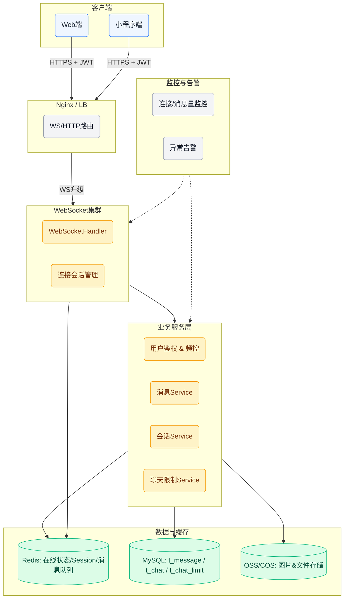
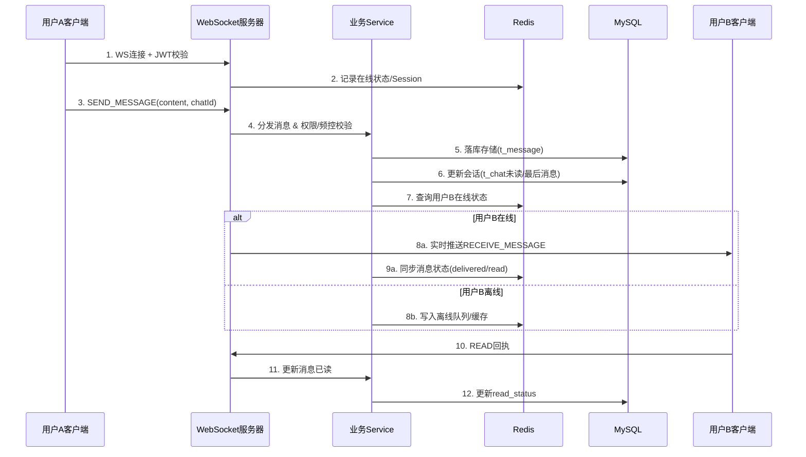

# 聊天功能前后端架构图

> **说明**：客户端通过 HTTPS 完成鉴权后升级为 WebSocket 长连接。WebSocket 层负责会话管理与消息路由，业务层执行消息校验、存储与限制控制，Redis/MySQL/OSS 分别承担在线状态、持久化与文件存储职责，配套监控体系保障运行稳定。

# 消息流转流程图

> **补充**：
> - 心跳：客户端每30秒发送 `HEARTBEAT`，服务器若超时则清理连接并同步 Redis。
> - 聊天限制：Biz 层依据 `t_chat_limit` 判断是否允许发送，必要时返回限制提示。
> - 防骚扰：频控 + 敏感词过滤在步骤4完成，违规消息直接拒绝并记录。

